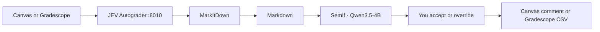

# JEV Autograder

<p align="center">
  <a href="https://github.com/TheoLeeCJ/SemIf-OpenJev"></a>
  <a href="https://github.com/microsoft/markitdown"></a>
  
  
</p>

<p align="center">
  本机批改 Canvas 和 Gradescope。一条命令完成安装。<br>
  Grade Canvas and Gradescope on your own machine. One command configures it.
</p>

Student files stay on this computer. [SemIf](https://github.com/TheoLeeCJ/SemIf-OpenJev) (formerly OpenJev) reads each rubric criterion as a typed decision from **Qwen3.5-4B**. [MarkItDown](https://github.com/microsoft/markitdown) turns PDF, Word, PowerPoint, and Excel uploads into Markdown before that scoring step.

SemIf is an independent project. It is not affiliated with TypeSafe or the hosted Jev service. This app uses SemIf's local readout (`semif-phase1`).



## One command

Empty machine, Windows:

```powershell
irm https://raw.githubusercontent.com/Marc0Guo/JEV-Autograder/main/install.ps1 | iex
```

Empty machine, macOS or Linux:

```bash
curl -fsSL https://raw.githubusercontent.com/Marc0Guo/JEV-Autograder/main/install.sh | bash
```

Already cloned:

```powershell
powershell -ExecutionPolicy Bypass -File .\install.ps1
```

```bash
bash install.sh
```

The script installs [uv](https://docs.astral.sh/uv/) and Python 3.12 if you do not have them, then runs `uv sync`.

| What gets installed | Where it comes from |
|---|---|
| This app | this repository |
| MarkItDown, with `pdf`, `docx`, `pptx`, `xlsx`, `xls` | [microsoft/markitdown](https://github.com/microsoft/markitdown) |
| `semif-phase1` at `23cf1f39` | [TheoLeeCJ/SemIf-OpenJev](https://github.com/TheoLeeCJ/SemIf-OpenJev) |

It does not download the model, ask for a token, or post a grade. The first grade fetches `Qwen/Qwen3.5-4B` at revision `851bf6e806efd8d0a36b00ddf55e13ccb7b8cd0a` from Hugging Face. A GPU that can hold a 4B BF16 model is the comfortable path. CPU works and is slow.

If uv and Python 3.12 are already installed:

```bash
uv sync
```

## Run

```bash
uv run autograde
```

Open http://127.0.0.1:8010.

1. Paste the Canvas URL and an API token from Canvas → Account → Settings → New Access Token. The token needs permission to see courses and to grade submissions.
2. For Gradescope, enter the instructor email and password. The password is not written to disk. Gradescope has no public grade-write API, so the app downloads a CSV you can import.
3. Load a course and assignment, edit the rubric once, then click **Start review**.
4. Each student opens with their submission beside the ratings. **Accept** posts the highlighted ratings to Canvas. Click a different rating first to override, then post. Skip leaves that student unposted.

Canvas tokens are saved in `data/config.json`. That folder is gitignored.

A rubric criterion is one SemIf question:

| Kind | How points are assigned |
|---|---|
| **score** | ordered levels; points are the probability-weighted level |
| **choice** | named options with points |
| **yes / no** | points for yes and for no, weighted by SemIf's probability |

The assignment point total scales that raw score.

## Canvas extension

The SpeedGrader control sits on the rubric. **Grade with JEV** scores the assignment open on that page, using its Canvas rubric.

1. Keep this app running at http://127.0.0.1:8010.
2. Open `chrome://extensions`, turn on Developer mode, and load the `extension` folder.
3. Open that assignment in Canvas SpeedGrader with the rubric visible on the right.
4. Click **Grade with JEV**. After the score comes back, the extension selects Full Marks, No Marks, or the other rating on each row. Submit the rubric in SpeedGrader to save.

## For agents

| Agent | Read this first |
|---|---|
| Any agent | [`AGENTS.md`](AGENTS.md) |
| Claude Code | [`CLAUDE.md`](CLAUDE.md) |
| Cursor | [`CURSOR.md`](CURSOR.md) |
| Codex | [`CODEX.md`](CODEX.md) |
| GitHub Copilot | [`.github/copilot-instructions.md`](.github/copilot-instructions.md) |

Each file contains the same install command.

## Tests

```bash
uv run python -m unittest discover -s tests -v
```

## Layout

| Path | Role |
|---|---|
| `install.ps1`, `install.sh` | one-command setup |
| `autograde/app.py` | local web app |
| `autograde/semif_backend.py` | SemIf shared readout |
| `autograde/documents.py` | MarkItDown conversion |
| `autograde/canvas_api.py`, `autograde/gradescope_api.py` | LMS clients |
| `extension/` | Canvas SpeedGrader panel |
| `compare_readonly.py`, `run_course_readonly.py` | local read-only comparisons, not part of setup |

## License

MIT. See [LICENSE](LICENSE).

SemIf-OpenJev and MarkItDown keep their own licenses. This project depends on them; it does not vendor their source.
