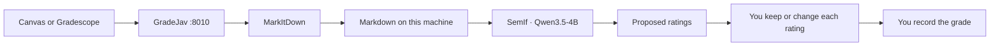

# GradeJav

<p align="center">
  <a href="https://github.com/TheoLeeCJ/SemIf-OpenJev"></a>
  <a href="https://github.com/microsoft/markitdown"></a>
  
  
</p>

<p align="center">
  Student work stays on your machine. The model proposes ratings. You decide what is recorded.
</p>


https://github.com/user-attachments/assets/9b0e1ca6-589f-4eb7-9fdc-46a293af0943


[SemIf](https://github.com/TheoLeeCJ/SemIf-OpenJev) (formerly OpenJev) reads each rubric criterion as a typed decision from **Qwen3.5-4B**, on this computer. [MarkItDown](https://github.com/microsoft/markitdown) turns PDF, Word, PowerPoint, and Excel uploads into Markdown before that scoring step. SemIf is an independent project. It is not affiliated with TypeSafe or the hosted Jev service. This app uses SemIf's local readout (`semif-phase1`).

## FERPA compliance

Student education records stay on the instructor's machine when you score with SemIf or Laya. Those backends do not send submission text to a hosted model API. The LLM API backend sends the submission and rubric to the base URL you configure (Anthropic, OpenAI, Ollama, or LM Studio).

| Record | Where it goes |
|---|---|
| Submission text, attachments, and proposed ratings | This computer for SemIf and Laya. The LLM API backend sends that text to the base URL you set. |
| Canvas API token and LLM API keys | `data/config.json` on this computer. `data/` is gitignored. `ANTHROPIC_API_KEY`, `OPENAI_API_KEY`, and `AUTOGRADE_LLM_API_KEY` are read from the environment when no key is saved. |
| Gradescope password | Used for the login session, then dropped. It is not written to disk. |
| The grade that enters the LMS | Only after you accept it in this app, submit the rubric in SpeedGrader, or import the Gradescope CSV. |
| Model weights | Downloaded once from Hugging Face when you grade for the first time. That download is the model, not student work. |

Canvas and Gradescope remain the systems your institution already uses to hold the official record. This app reads from them and writes back only the grade you confirm. Your school still owns the rest of FERPA: who may access the machine, how long records are kept, and what your campus policy says about AI in grading.

## Human–AI collaboration

GradeJav proposes a rating for each rubric row. You see the student's work beside that proposal and you choose what gets recorded.

1. The model scores the rubric you already use: Full Marks, No Marks, or the other levels on that assignment.
2. You read the submission and the proposed ratings together.
3. You change any rating you disagree with.
4. You record the grade yourself. In the local app that button is **Accept**. In SpeedGrader it is **Submit Assessment**. For Gradescope you import the CSV. Skip, or close the page, leaves that student unposted.



## One command

Empty machine, Windows:

```powershell
irm https://raw.githubusercontent.com/Marc0Guo/JEV-Autograder/main/install.ps1 | iex
```

Empty machine, macOS or Linux:

```bash
curl -fsSL https://raw.githubusercontent.com/Marc0Guo/JEV-Autograder/main/install.sh | bash
```

Already cloned:

```powershell
powershell -ExecutionPolicy Bypass -File .\install.ps1
```

```bash
bash install.sh
```

The script installs [uv](https://docs.astral.sh/uv/) and Python 3.12 if you do not have them, then runs `uv sync`.

| What gets installed | Where it comes from |
|---|---|
| This app | this repository |
| MarkItDown, with `pdf`, `docx`, `pptx`, `xlsx`, `xls` | [microsoft/markitdown](https://github.com/microsoft/markitdown) |
| `semif-phase1` at `23cf1f39` | [TheoLeeCJ/SemIf-OpenJev](https://github.com/TheoLeeCJ/SemIf-OpenJev) |
| `laya` at `2e4d9c87` | [NandhaKishorM/laya](https://github.com/NandhaKishorM/laya) |

It does not download the model, ask for a token, or post a grade. The first grade fetches `Qwen/Qwen3.5-4B` at revision `851bf6e806efd8d0a36b00ddf55e13ccb7b8cd0a` from Hugging Face. A GPU that can hold a 4B BF16 model is the comfortable path. CPU works and is slow.

If uv and Python 3.12 are already installed:

```bash
uv sync
```

## Run

```bash
uv run autograde
```

Open http://127.0.0.1:8010.

1. Paste the Canvas URL and an API token from Canvas → Account → Settings → New Access Token. The token needs permission to see courses and to grade submissions.
2. For Gradescope, enter the instructor email and password. The password is not written to disk. Gradescope has no public grade-write API, so the app downloads a CSV you can import.
3. Load a course and assignment, edit the rubric once, then click **Start review**.
4. Each student opens with their submission beside the ratings. **Accept** posts the highlighted ratings to Canvas. Click a different rating first to override, then post. Skip leaves that student unposted.

Canvas tokens are saved in `data/config.json`. That folder is gitignored.

A rubric criterion is one SemIf question:

| Kind | How points are assigned |
|---|---|
| **score** | ordered levels; points are the probability-weighted level |
| **choice** | named options with points |
| **yes / no** | points for yes and for no, weighted by SemIf's probability |

The assignment point total scales that raw score.

## Scoring backend

The Connections panel chooses the scorer. SemIf stays the default.

| Backend | How to use it |
|---|---|
| **GradeJav / SemIf** | Local Qwen3.5-4B through `semif-phase1`. The first grade downloads that checkpoint. |
| **Laya** | [Laya](https://github.com/NandhaKishorM/laya) `2e4d9c87`, the open System One model with the same choice, score, and yes/no questions. `uv sync` installs the package. The first Laya grade downloads the checkpoint the router selects. Leave the checkpoint blank, or set `english`, `multilingual`, or `typed-decisions`. A CUDA or ROCm build of PyTorch is used when `torch.cuda.is_available()` is true; otherwise scoring runs on CPU. |
| **LLM API** | Anthropic Messages, OpenAI Chat Completions, or any OpenAI-compatible server. Presets fill the base URL for Anthropic (`https://api.anthropic.com`), OpenAI (`https://api.openai.com/v1`), Ollama (`http://127.0.0.1:11434/v1`), and LM Studio (`http://127.0.0.1:1234/v1`). Set the model name the server expects. Anthropic and OpenAI need an API key. Ollama and LM Studio do not, unless that server asks for one. |

API keys are saved in `data/config.json` under `llm_keys`, one slot per provider. A blank key field keeps the saved key. Environment variables are used only when that slot is empty. Timeouts and HTTP errors are shown in the page; a failed call does not become a score.

## Canvas extension

The SpeedGrader control sits on the rubric. **Grade** scores the assignment open on that page, using its Canvas rubric.

1. Keep this app running at http://127.0.0.1:8010.
2. Open `chrome://extensions`, turn on Developer mode, and load the `extension` folder.
3. Open that assignment in Canvas SpeedGrader with the rubric visible on the right.
4. Click **Grade**. After the score comes back, the extension selects Full Marks, No Marks, or the other rating on each row. Submit the rubric in SpeedGrader to save.

## For agents

| Agent | Read this first |
|---|---|
| Any agent | [`AGENTS.md`](AGENTS.md) |
| Claude Code | [`CLAUDE.md`](CLAUDE.md) |
| Cursor | [`CURSOR.md`](CURSOR.md) |
| Codex | [`CODEX.md`](CODEX.md) |
| GitHub Copilot | [`.github/copilot-instructions.md`](.github/copilot-instructions.md) |

Each file contains the same install command.

## Tests

```bash
uv run python -m unittest discover -s tests -v
```

## Layout

| Path | Role |
|---|---|
| `install.ps1`, `install.sh` | one-command setup |
| `autograde/app.py` | local web app |
| `autograde/semif_backend.py` | SemIf shared readout |
| `autograde/laya_backend.py` | Laya local scorer |
| `autograde/llm_backend.py` | Anthropic and OpenAI-compatible scorers |
| `autograde/documents.py` | MarkItDown conversion |
| `autograde/canvas_api.py`, `autograde/gradescope_api.py` | LMS clients |
| `extension/` | Canvas SpeedGrader panel |
| `compare_readonly.py`, `run_course_readonly.py` | local read-only comparisons, not part of setup |

## License

MIT. See [LICENSE](LICENSE).

SemIf-OpenJev, Laya, and MarkItDown keep their own licenses. This project depends on them; it does not vendor their source.
